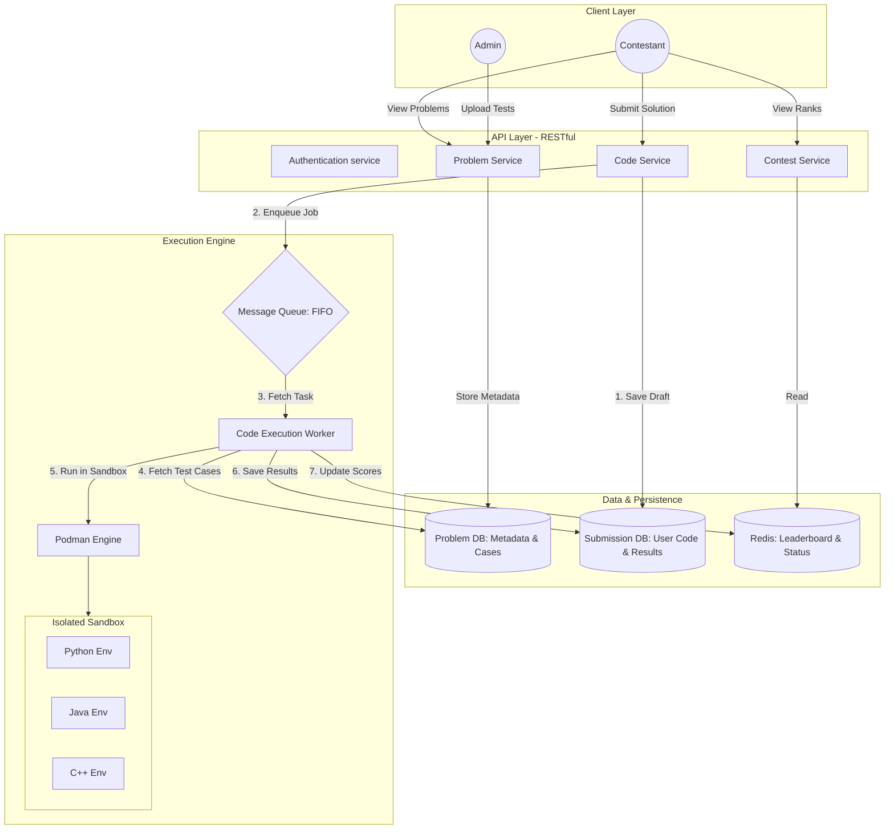

# PodVerdict
**Secure, Distributed Online Judge System**

PodVerdict is a full-stack asynchronous coding judge. It handles high-volume code submissions by decoupling the request handling (API) from the code execution (Worker) using a Redis-backed queue.


## System Highlights

- **Architecture**: Distributed system using the Producer-Consumer pattern
- **Security**: Rootless Podman containers with strict resource quotas (CPU, RAM, PIDs)
- **Isolation**: Each submission runs in a temporary, network-isolated environment (`--net none`)
- **Performance**: Built with Bun for minimal overhead and high-speed execution

## Technical Workflow

1. **API Server**: Validates JWT, stores submission as PENDING, and pushes a job to BullMQ
2. **Redis**: Acts as the message broker, ensuring no submission is lost
3. **Worker**: Picks up jobs, generates a unique workspace, and spawns a Podman container
4. **Judge Logic**: Executes code against hidden test cases and updates the DB with the final verdict (ACCEPTED, WRONG_ANSWER, TLE, RE)

## Software architecture



## Setup & Installation

### Clone & Install
```bash
git clone https://github.com/devian-321/podverdict.git
cd podverdict
bun install
```

### Environment Variables
Create a `.env` file with the following:
```
PORT=
JWT_SECRET=
DATABASE_URL=
REDIS_URL=
```

### Spin up Infrastructure
```bash
# Using podman-compose
podman-compose up -d
```

### Initialize Database
```bash
bunx prisma migrate dev
```

## 🛡️ Security Features Tested

- **Time Limit Exceeded (TLE)**: Hard 5s timeout using exec signals
- **Memory Limit Exceeded (MLE)**: Restricted to 128MB via Podman flags
- **Fork Bomb Protection**: Restricted to 64 PIDs per container
- **Network Isolation**: Zero internet access for user-submitted code

## 📦 Tech Stack

- **Backend**: Node.js with Express & TypeScript
- **Database**: PostgreSQL with Prisma ORM
- **Queue**: Redis with BullMQ
- **Runtime**: Bun
- **Containerization**: Podman
- **Authentication**: JWT

## 👨‍💻 Author

Anshuman Tiwari (devian-321)